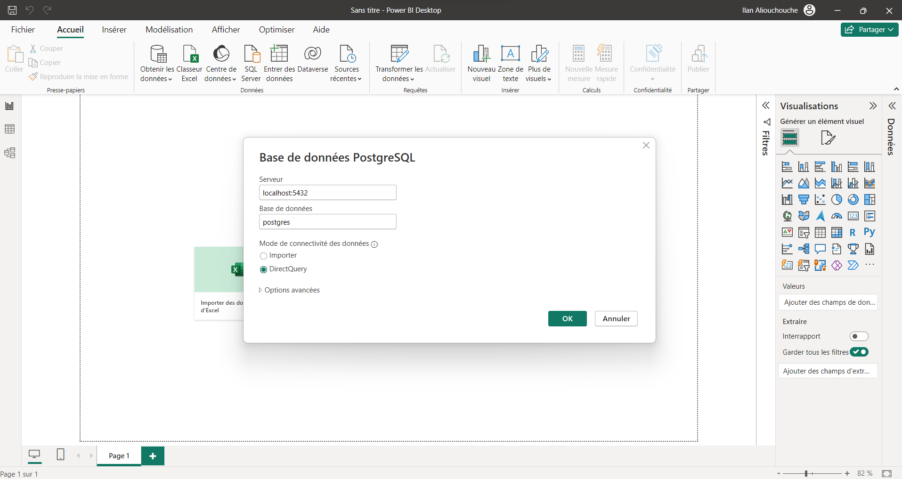

# Reporting Section 📊

## Overview

This README document outlines the reporting aspect of our project. It specifically focuses on the implementation and usage of PowerBI in conjunction with the PGVector database. Our objective is to provide a comprehensive guide for setting up the necessary components and navigating through the reporting functionalities.

## Setting Up the Database

The project uses PGVector, a powerful database extension for PostgreSQL. To set up the database, follow these steps:

1. Launch a PGVector container using Docker:
   ```shell
   docker run --name db_sc -p 5432:5432 -e POSTGRES_PASSWORD=dw2 -v data:/var/lib/postgresql/data -d ankane/pgvector
   ```

## Connecting to the Database with PowerBI

Once the database is running, the next step is to connect it with PowerBI:

1. Open PowerBI.
2. Use the database connection details to establish a connection with the PGVector database.

<p align="left">
  
</p>

## Data Schema

The data schema will be presented here with a detailed image to give a clear understanding of the database structure.

<p align="left">
  
</p>

## Dashboard Overview

The dashboard in PowerBI provides visualizations on films released this week. It includes several interactive features and graphics:

- Duration of films.
- Ratings of the films.
- Number of reviews.
- Negativity analysis of the reviews.
- A map indicating the country of origin for the selected film.
- Film posters that serve as interactive filters for the dashboard.
- One of the directors of the film.
- The number of likes accumulated by all the reviews of the selected film.
- The number of comments accumulated by all the reviews of the selected film.
- The name of the film.

<p align="left">
  
  
</p>

## Additional Resources

The PowerBI file can be accessed [here](/reporting/report_film.pbix).